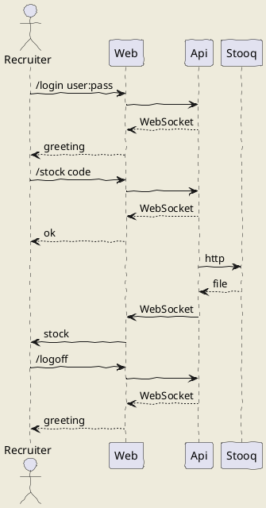

# CHAT

## Doc
See [PDF](./docs/net-challenge-financial-chat_6137a578d338d.pdf)

UML

## API

### Prerequisites
1. Install .Net `brew install dotnet`
1. Build `dotnet build`

### Run
1. Execute `dotnet run`

## Web

### Prerequisites
1. Install Rust `brew install rustup`
1. Install Compiler `rustup install webasm32-unknown-unknown`
1. Install Yew `cargo install yew`

### Run
1. Execute `trunk --release --open`